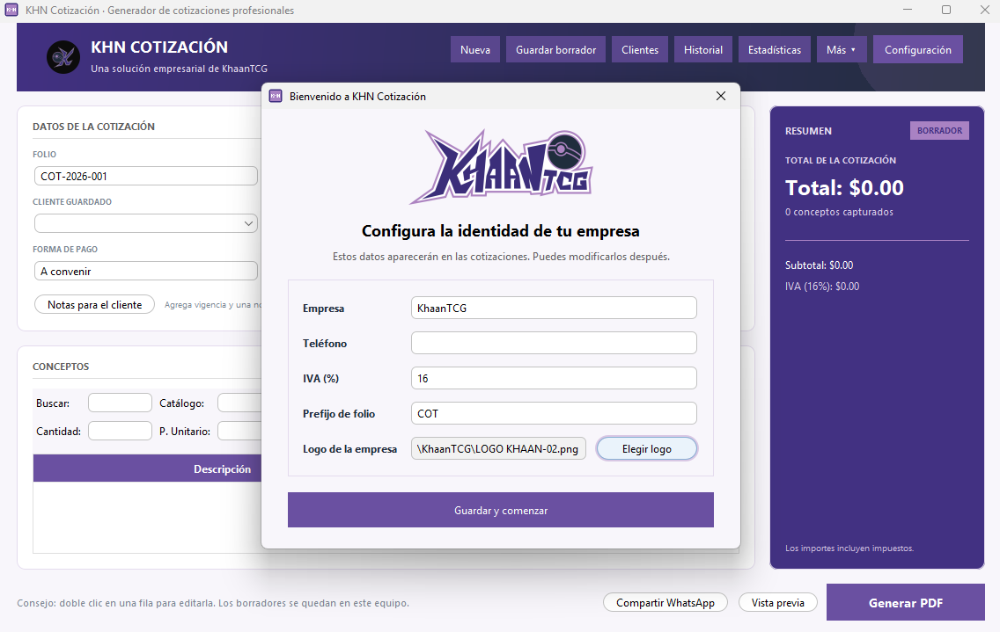

  

  
Building useful Java software from real-world problems.

  
  
  

---

## 01 / About

<table>
  <tr>
    <td width="33%" valign="top">
      <strong>🎯 Current goal</strong> 
      Earn my first Java trainee or junior developer opportunity.
    </td>
    <td width="33%" valign="top">
      <strong>🧠 How I learn</strong> 
      I turn real needs into projects, then understand every technical decision.
    </td>
    <td width="33%" valign="top">
      <strong>⚡ Current focus</strong> 
      Java, OOP, collections, Maven, testing, and desktop development.
    </td>
  </tr>
</table>

I am building software with the care I would expect as a user: clear flows, reliable calculations, useful documentation, and an interface that feels intentional. I do not just want code that works—I want to understand why it works and how to improve it.

## 02 / Featured work

  
   
  First-run setup · click the preview to explore the repository

### KHN Cotización · v1.4.3

A professional desktop application for creating branded PDF quotations. Each business can configure its own identity and logo, manage clients and catalog items, calculate amounts precisely, keep local history and backups, preview documents, and prepare a WhatsApp-ready share flow.

  
  
  

  <code>Java 17</code>
  <code>Swing</code>
  <code>Maven</code>
  <code>Apache PDFBox</code>
  <code>Gson</code>
  &nbsp; <a href="https://github.com/KhaanTCG/khn-cotizacion"><strong>Explore the product repository →</strong></a>

## 03 / Stack

  
  
  
  
  
  

  
<strong>Also exploring</strong>

   
  SQL fundamentals, Spring Boot, automated testing, REST APIs, HTML, CSS, JavaScript, and Python.

## 04 / Learning path

| Stage | What I practice | Evidence |
| --- | --- | --- |
| Fundamentals | Syntax, variables, conditionals, and methods | [java-basics](https://github.com/KhaanTCG/java-basics) |
| Logic and collections | Menus, loops, `ArrayList`, and validation | [inventario-java](https://github.com/KhaanTCG/inventario-java) |
| Real-world project | OOP, PDF generation, local persistence, UI, testing, packaging, and product design | [KHN Cotización](https://github.com/KhaanTCG/khn-cotizacion) |
| Next level | SQL, Spring Boot, REST APIs, and backend development | In progress ⚡ |

## 05 / Next evolution

| Next skill | Why it matters to me |
| --- | --- |
| Spring Boot and REST APIs | Build backend services that real applications can depend on. |
| SQL and data modeling | Store, query, and reason about application data confidently. |
| Automated testing | Change code with confidence instead of crossing my fingers. |
| Product polish | Make software easy to install, use, and explain in an interview. |

## 06 / Opportunities

<table>
  <tr>
    <td valign="top">
      <strong>Open to</strong> 
      Trainee · Internship · Junior roles
    </td>
    <td valign="top">
      <strong>Interested in</strong> 
      Java development · Desktop software · Application support
    </td>
    <td valign="top">
      <strong>Best starting point</strong> 
      <a href="https://github.com/KhaanTCG/khn-cotizacion">Explore KHN Cotización →</a>
    </td>
  </tr>
</table>

I am ready to learn from a team, contribute with discipline, and keep building useful software.

   
  <i>“I level up by facing real problems, learning from every build, and improving one step at a time.”</i>
    
  

